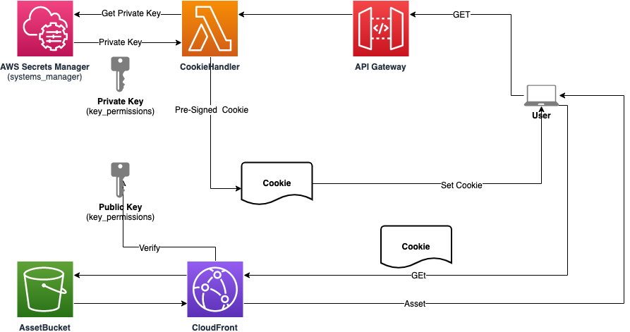
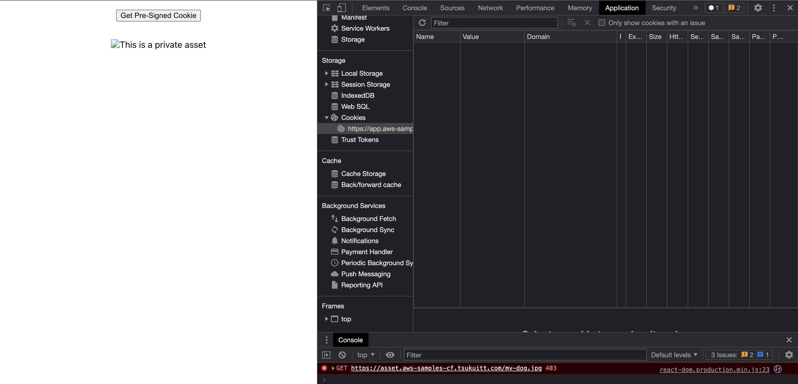
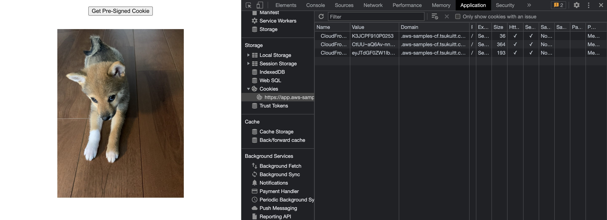

## Protect caches in CloudFront using signed cookie

This is a serverless web app protecting cached assets in CloudFront by [using signed cookie](https://docs.aws.amazon.com/AmazonCloudFront/latest/DeveloperGuide/private-content-signed-cookies.html).



## 1. Prepare a Hosted Zone in Route53

**Only public hosted zone is tested.**

1. Note `Domain name` and `Hosted zone ID`.
2. Edit `./cdk.json`

```json
  "config": {
    "domainName": "Replace with Domain Name",
    "hostedZoneId": "Replace with Hosted zone ID",
    //
  }
```

## 2. Generate key and upload it to Secrets Manager

1. Run the following command on your terminal.

```sh
KEYPAIR_NAME=signed-cookie
openssl genrsa -out ${KEYPAIR_NAME}.pem 2048
openssl rsa -pubout -in ${KEYPAIR_NAME}.pem -out ${KEYPAIR_NAME}_pub.pem
aws secretsmanager create-secret \
 --name ${KEYPAIR_NAME} \
 --secret-binary fileb://${KEYPAIR_NAME}.pem
```

Then you get the json like below.

```json
{
  "ARN": "arn:aws:secretsmanager:yourregion:accountnumber:secret:signed-cookie-ascii",
  "Name": "signed-cookie",
  "VersionId": "XXXX"
}
```

Note `ARN`.

2. Edit `./cdk.json`

```json
  "config": {
    "privateKeySecretCompleteArn": "Replace with ARN in the above json"
    //
  }
```

## 3. Create Trusted Key Group on AWS Console

1. Open [CloudFront](https://console.aws.amazon.com/cloudfront/v3/home)
2. Go to [Key Management > Public Keys](https://console.aws.amazon.com/cloudfront/v3/home?#/publickey)
3. Click [Create public key](https://console.aws.amazon.com/cloudfront/v3/home#/publickey/create)
4. Paste `${KEYPAIR_NAME}_pub.pem` created the previouss step. Name has no effect to this deployment. And hit `Create public key`.
5. Got to [Key Management > Key groups](https://console.aws.amazon.com/cloudfront/v3/home#/keygrouplist)
6. Click [Create key group](https://console.aws.amazon.com/cloudfront/v3/home#/keygrouplist/create)
7. Input your favorite Name and select the public key you created before in `Public keys` field. And hit `Create key group`.
8. Move to the detail page of the key group.
9. Edit `./cdk.json`

```json
  "config": {
    "keypairId": "ID on Public keys panel",
    "publicKeyId": "ID on Details panel",
    //
  }
```

## 4. deploy with cdk

```sh
npm ci
npm run cdk bootstrap
npm run cdk bootstrap -- --region=us-east-1
npm run cdk deploy -- --all
```

certificate-stack is only deployable in `us-east-1`.

## 5. Test on the browser

1. Open the url https://app.{your domain}. eg. https://app.example.com if your domain is example.com
2. Image is not visible.
   
3. Click `Get Signed Cookie` button.
4. You see my pretty dog and cookie in dev tool.
   

## Clean up

```sh
npx cdk destroy --force --all
```

## Security

See [CONTRIBUTING](CONTRIBUTING.md#security-issue-notifications) for more information.

## License

This library is licensed under the MIT-0 License. See the LICENSE file.
